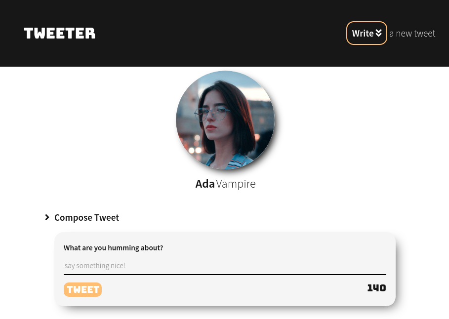
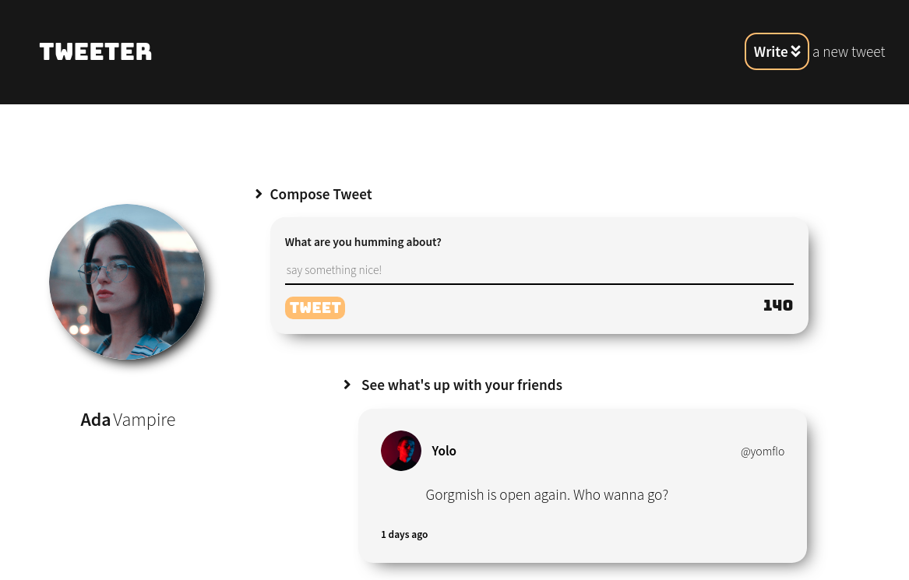
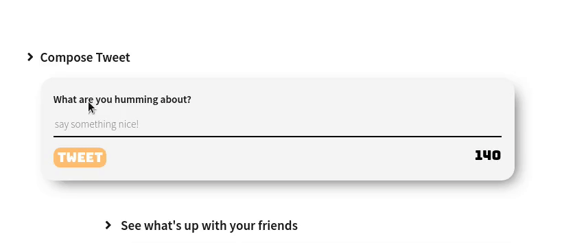
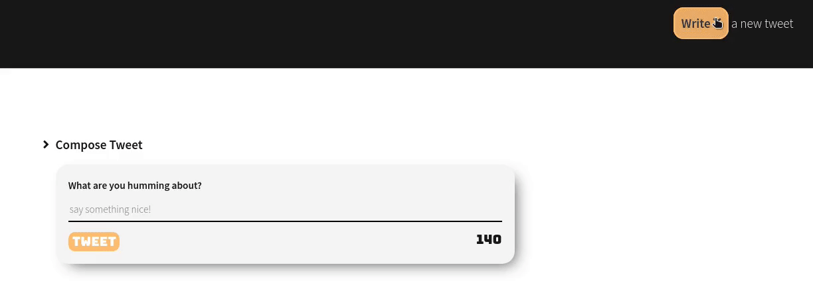
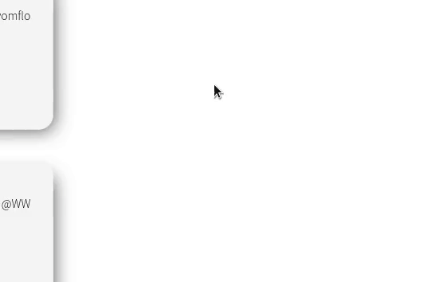

# Tweeter Project

Tweeter is a simple, single-page Twitter clone.

This is a completed project based on the given code by Lighthouse Labs

## Getting Started

Clone Repo and Run

```
npm install
npm run local
```

visit in Browser

```
localhost:8080/
```

## Screenshots and Features

mobile


iPad



Desktop



New Tweet Generation


Warning



Toggle Action



Scroll Up Action



## Dependencies

- Express
- Node 5.10.x or above
- body-parser": "^1.15.2",
- chance": "^1.0.2",
- express": "^4.13.4",
- jquery-confirm": "^3.3.4",
- md5": "^2.1.0",
- moment": "^2.29.1"
